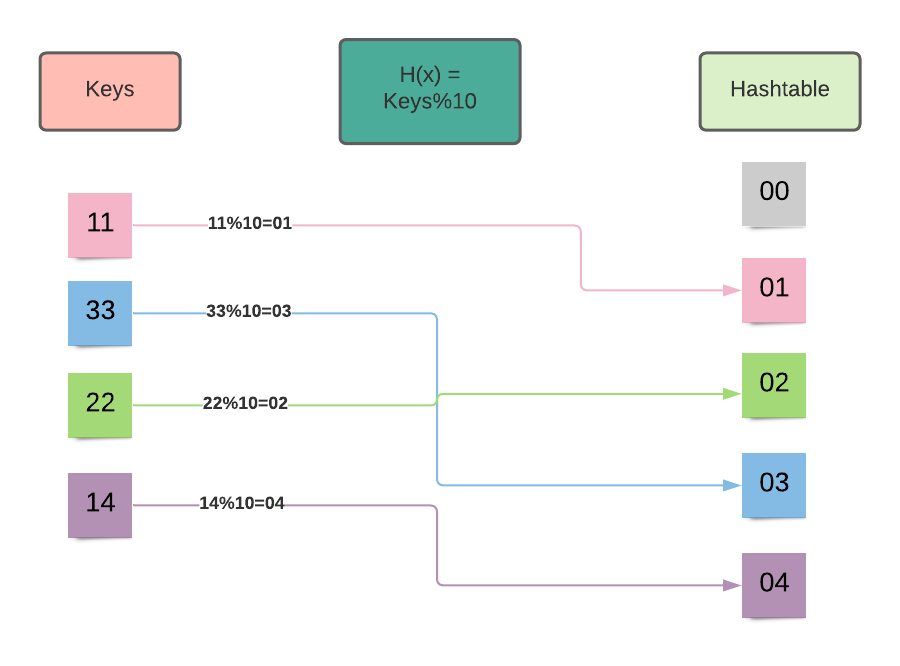

# Hashing

Hashing is the technique to convert the range of key-value pairs to a range of indices. In hashing, we use hash
functions to map keys to some values.

# Example Of Hashing

Example :
Let arr=[11,33,22,14]

hashIndex = (key %10)

# Collision:

The hash function may map two
key values to a single index. Such a situation is known as a collision

### Example Of Collision:

Let 1l=[22,42,64,71]

H(x) = keys%10

In the above image, you can see that the 22 and 42 are mapped to the index number 2. Therefore we need to avoid the
collision. Following techniques are used to avoid collision in hashing :

### Open addressing:

    In Open addressing if collision happens that value will be store in next empty index.

### Chaining:

    In Chaining, there is another array is linking to that index and stroing value in that array. If collision happen